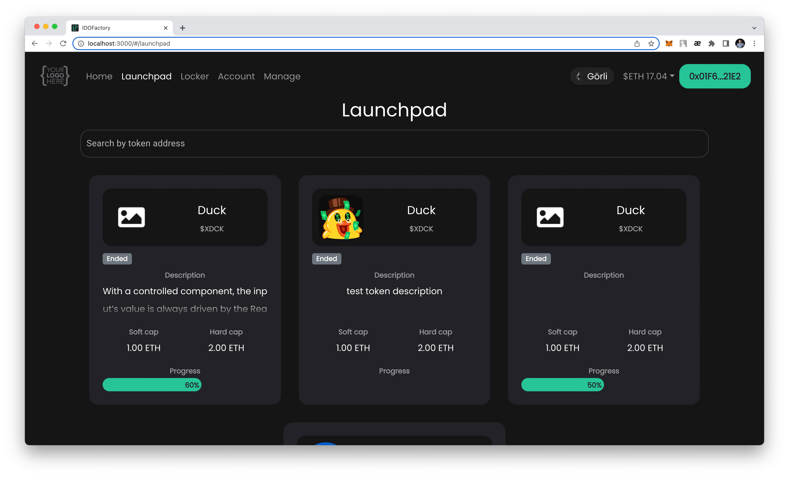
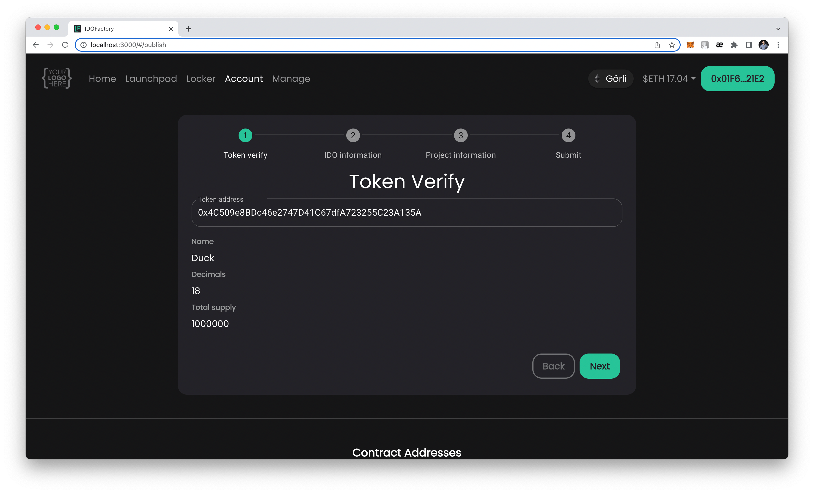
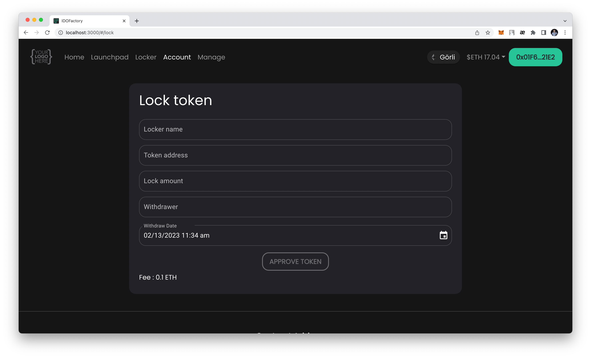

# IDOFactory

White-label Decentralized IDO Launchpad Platform

## Installation

1. Install dependencies

    ```bash
    npm i
    ```

2. Start app

    ```bash
    npm start
    ```

Open [http://localhost:3000](http://localhost:3000) with your browser to see the result.

Article is published [here, continue reading ...](https://celo.academy/t/building-a-decentralised-ido-launchpad-on-celo-blockchain-a-comprehensive-tutorial-for-solidity-developers/864)

## Todo List

Demo: https://launchpad.0xfactory.com/

Presale Contract: https://0xfactory.com/launchpad-contract


## Launch and Setting Up Application

[Read](./docs/launchAndSettingUp.md)

## Add a new EVM-like chain

[Read](./docs/addNewNetwork.md)

## Images

1. Home page
    
1. Launchpad page
    
1. IDO info pages
    
    
1. Locker page
    
1. Locker info page
    
1. Account page
    
1. Create Launchpad Pool pages
    
    
    
    
    
1. Lock Token page
    

## License

[MIT](./LICENSE)


## Other Package

- <a href="https://omisoft.net/demo/notcoin-script?utm_campaign=web3-crypto-launchpad&utm_medium=social&utm_source=github" target="_blank">NotCoin Like Game</a>
- <a href="https://omisoft.net/demo/crypto-lottery?utm_campaign=web3-crypto-launchpad&utm_medium=social&utm_source=github" target="_blank">Crypto Lottery</a>
- <a href="https://omisoft.net/demo/white-label-dex-solutions?utm_campaign=web3-crypto-launchpad&utm_medium=social&utm_source=github" target="_blank">Dex Platform</a>
- <a href="https://omisoft.net/demo/white-label-crypto-launchpad-development?utm_campaign=web3-crypto-launchpad&utm_medium=social&utm_source=github" target="_blank">ICO & IDO Launchpad</a>
- <a href="https://omisoft.net/demo/whitelabel-nft-marketplace-development?utm_campaign=web3-crypto-launchpad&utm_medium=social&utm_source=github" target="_blank">NFT Marketplace</a>
- <a href="https://omisoft.net/demo/meme-coin-development-service?utm_campaign=web3-crypto-launchpad&utm_medium=social&utm_source=github" target="_blank">Meme Coin Solution</a>

## Contact us

- <a href="https://omisoft.net/contact-us?utm_campaign=web3-crypto-launchpad&utm_medium=social&utm_source=github" target="_blank">Contact Us page</a>